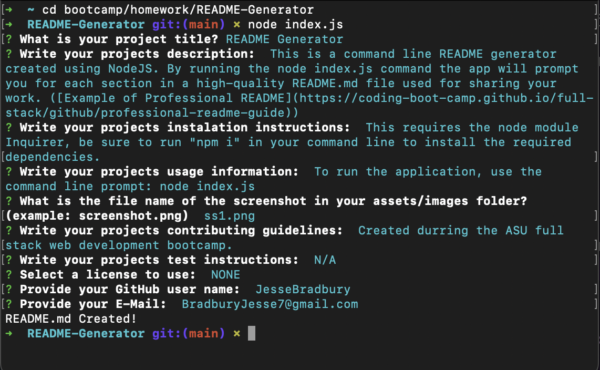

#  README Generator   
  
## Description:
This is a command line README generator created using NodeJS. Run the "node index.js" command, the app will prompt you for the details to include for each section in a high-quality README.md file. ([Example of Professional README](https://coding-boot-camp.github.io/full-stack/github/professional-readme-guide))

I created this as a practice project for creating command line apps and NodeJS. 

This app also prompts you for the file name of a screenshot for your project to include in the Usage section. Your screen shot must be in a assets/images directory, if it is not feel free to adjust the markdown file after it is created. 

Thank you for checking out my project, Enjoy!
  
## Table of Contents 
  - [Installation](#installation)
  - [Usage](#usage)
  - [Credits](#credits)
  - [License](#license)
  - [Questions](#questions)

## Instalation:
This requires the node module Inquirer, be sure to run "npm i" in your command line to install the required dependencies. 

## Usage:
To run the application, use the command line prompt: node index.js 
Once you've answered all the questions, a README file will be created or appended in the root file. 
  

## Credits:
Created as an assignment for the ASU full stack web development bootcamp. 

## License:
-[MIT](https://opensource.org/license/mit/) 

## Questions
Find me on [GitHub](https://github.com/JesseBradbury)

Send me an E-Mail at [Bradburyjesse7@gmail.com](mailto:Bradburyjesse7@gmail.com)

### Thank You!
###### Generated by the README Generator
  